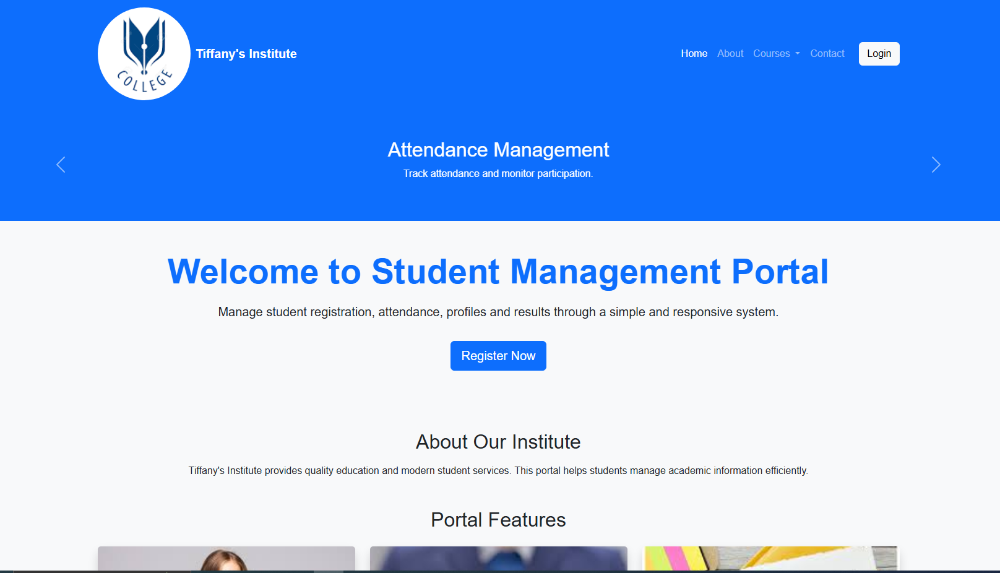

# Responsive Student Management Portal

## Project Overview

The Responsive Student Management Portal is a web-based application developed using HTML5, CSS3, Bootstrap 5, and JavaScript. The portal provides an easy-to-use interface for managing student information including registration, profile management, attendance monitoring, results management, and communication.

The website is fully responsive and adapts to mobile, tablet, and desktop devices.

---

## Technologies Used

- HTML5
- CSS3
- Bootstrap 5
- JavaScript

---

## Bootstrap Components Used

- Navbar
- Grid System
- Typography
- Buttons
- Cards
- Forms
- Input Groups
- Tables
- Alerts
- Badges
- Dropdown Menu
- Collapse
- Accordion
- Modal
- Carousel

---

## Project Pages

### Home Page
- Responsive Navbar
- Hero Section
- Carousel
- Feature Cards
- Dropdown Menu
- Accordion
- Modal
- Footer

### Student Registration Page
- Student Registration Form
- Input Groups
- File Upload
- Form Validation
- Terms and Conditions Checkbox

### Student Dashboard
- Statistics Cards
- Search Box
- Responsive Table
- Attendance Badges
- Alert Component

### Student Profile
- Profile Card
- Student Details
- Profile Image
- Edit Profile Button

### Contact Page
- Contact Form
- Alert Message
- Send Message Button
- Reset Button

---

## Responsive Design

### Mobile (<576px)
- Single-column layout
- Collapsible Navbar
- Responsive Forms and Cards

### Tablet (≥768px)
- Two-column layouts where applicable

### Desktop (≥992px)
- Multi-column layouts
- Dashboard cards displayed in rows

---

## Project Structure

```text
student-management-portal/
│
├── index.html
├── registration.html
├── dashboard.html
├── profile.html
├── contact.html
├── README.md
│
├── css/
│   └── style.css
│
├── images/
│
└── screenshots/
    ├── home-page.png
    ├── registration-form.png
    ├── dashboard.png
    └── mobile-view.png
```

---

## Screenshots

### Home Page



### Registration Form


### Dashboard


### Mobile View


---

## How to Run the Project

1. Download or clone the repository.
2. Open the project folder.
3. Open `index.html` in any web browser.
4. Navigate through the portal using the navbar.

---

## GitHub Repository

Repository Link:

https://github.com/navyakammalapally/Student-Management

---

## Author

**Kammalapally Navya**

Student Management Portal Project using Bootstrap 5.